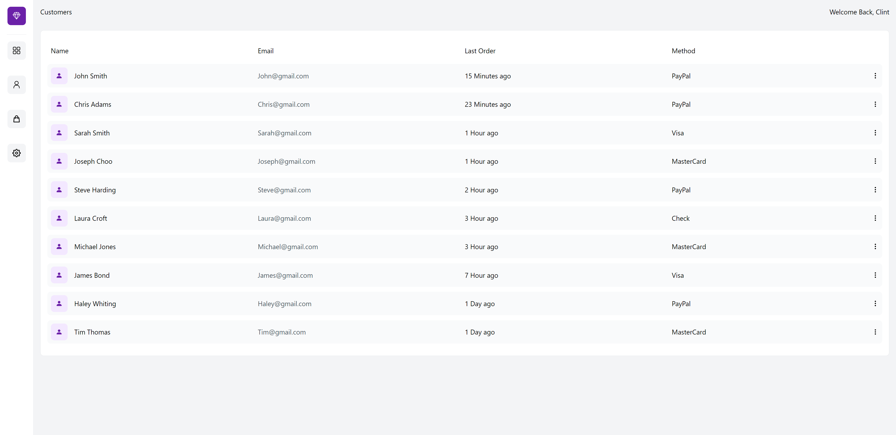

# Resposive User Admin Dashboard made with Next.js, TailwindCSS, and Chart.js

 

## 💻 Demonstration

 

<h5 align="center"> 🔗 Online demonstration: https://nextjs13-dashboard.vercel.app/</h5>

 

## Built With

- [Chat.js](https://www.chartjs.org/)
- [Tailwind CSS](https://tailwindcss.com)
- [Next.js](https://nextjs.org)
- [Vercel](https://vercel.com)
